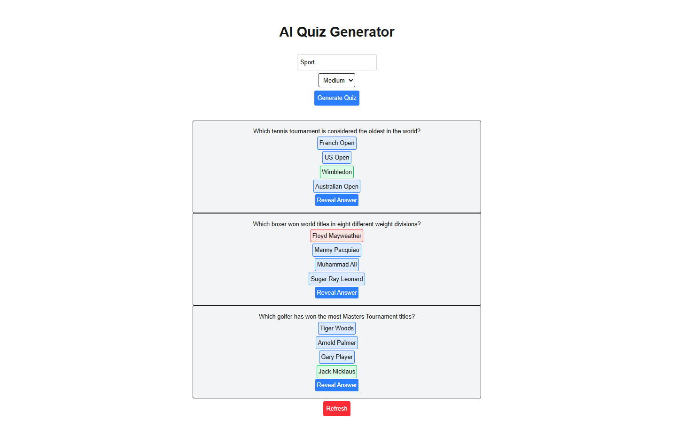

# 🤖 AI Quiz Generator

A full-stack interactive quiz application built with **Next.js 14**, **TypeScript**, and **AI Integration (Groq/Llama 3)**.
Users can enter any topic, select a difficulty level, and instantly generate a unique multiple-choice quiz with real-time scoring and feedback.



## ✨ Features

- **🚀 AI-Powered Generation:** Generates 3 unique questions on *any* topic using the Groq API.
- **🎛️ Customizable Difficulty:** Choose between Easy, Medium, or Hard modes.
- **✅ Interactive UI:** Instant visual feedback (Green/Red) for correct/incorrect answers.
- **🛡️ Robust Error Handling:** Loading states, input validation, and empty field protection.
- **🔄 Reset Functionality:** Ability to clear state and generate a new quiz without reloading.

## 🛠️ Tech Stack

- **Framework:** Next.js 14 (App Router)
- **Language:** TypeScript
- **Styling:** Tailwind CSS
- **AI Model:** Llama 3 (via Groq API)
- **State Management:** React Hooks (useState)

## 🚀 Getting Started

Follow these steps to run the project locally:

1.  **Clone the repository:**
    ```bash
    git clone https://github.com/LukaPejicTU/ai-quiz-generator
    cd ai-quiz-generator
    ```

2.  **Install dependencies:**
    ```bash
    npm install
    ```

3.  **Set up Environment Variables:**
    Create a `.env.local` file in the root directory and add your Groq API key:
    ```env
    GROQ_API_KEY=your_api_key_here
    ```

4.  **Run the development server:**
    ```bash
    npm run dev
    ```

5.  Open http://localhost:3000 in your browser.

## 🧠 What I Learned

Building this project helped me master several key Full Stack concepts:

- **Next.js App Router:** Building API routes (`route.ts`) to securely handle server-side logic and protect API keys.
- **Prompt Engineering:** Structuring system prompts to force the AI to return strict JSON data for the frontend.
- **React State & Props:** Managing complex state (`loading`, `questions`, `score`) and lifting state up to share data between parent and child components.
- **TypeScript Interfaces:** Defining strict types for API responses to prevent runtime errors.
- **Conditional Rendering:** Dynamically styling UI elements based on user interaction (e.g., changing button colors on selection).

## 🔮 Future Improvements

- [ ] Add a "Summary Screen" at the end of the quiz.
- [ ] Save high scores to a database (PostgreSQL/Prisma).
- [ ] Add a countdown timer for each question.

---

*Built by Luka Pejic
